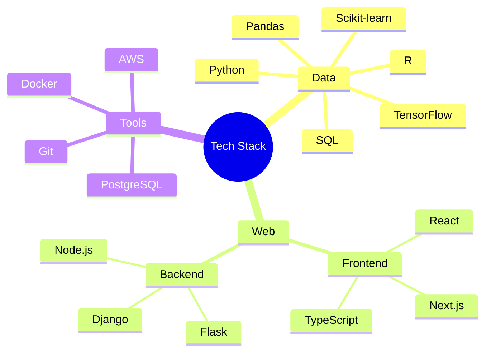

# Declan Mayo

  <picture>
    <source media="(prefers-color-scheme: dark)" srcset="https://raw.githubusercontent.com/platane/snk/output/github-contribution-grid-snake-dark.svg">
    <source media="(prefers-color-scheme: light)" srcset="https://raw.githubusercontent.com/platane/snk/output/github-contribution-grid-snake.svg">
    
  </picture>

  

 

  
  

## Tech Stack

## Professional Focus

At [Biologic Environmental](https://biologicenv.com.au/), I specialize in developing data-driven solutions and full-stack applications that bridge environmental science with modern technology. My work involves:

- Architecting scalable data pipelines
- Developing machine learning models for environmental monitoring
- Creating intuitive data visualizations
- Building enterprise-grade web applications

## Featured Projects

| Project | Tech Stack | Description |
|---------|------------|-------------|
| [Environmental Analytics Platform](https://github.com/DMayoBiologic) | `Python` `React` `AWS` | Real-time environmental data analysis platform |
| [Geospatial Visualization Tool](https://github.com/DMayoBiologic) | `R` `D3.js` `PostgreSQL` | Interactive mapping for ecological data |
| [ML Pipeline Framework](https://github.com/DMayoBiologic) | `Python` `TensorFlow` `Docker` | Automated machine learning pipeline for environmental metrics |

## Engagement

  

 

  
  
  

  

